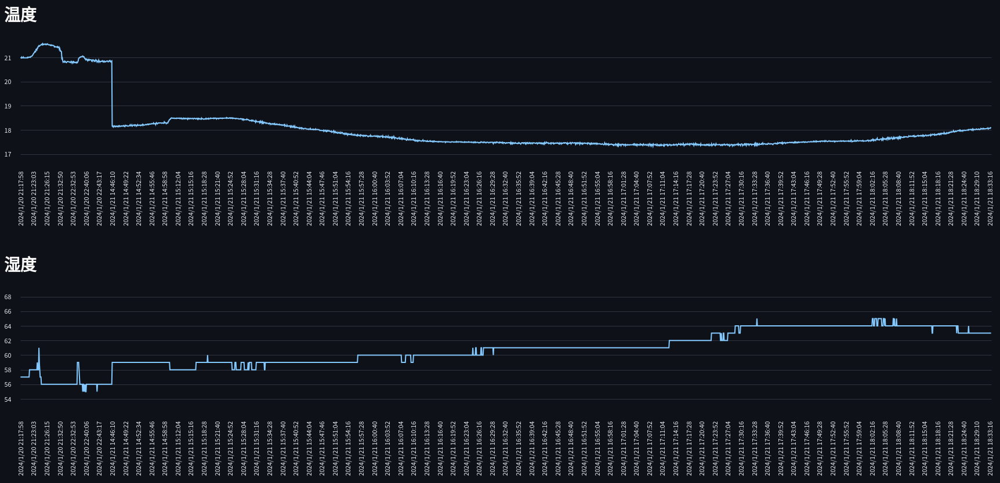

# 实时监控小米温度计2的温湿度信息，并保存



## 安装

我们建议通过 venv 进行环境管理。

执行以下命令新建一个 venv 环境并安装所需依赖：

PowerShell
```
python -m venv mi-env
.\mi-env\Scripts\Activate.ps1
pip install -r requirements.txt
```

请注意，本项目可能需要 Python 3.10 或更高版本。

## 运行

运行save_data.py

之后会自动打开网页，点击左上角的Connect，选择LYWSD03MMC并配对，成功后数据会自动写入data.json

如果无法搜索蓝牙设备，请在浏览器中启用 Experimental Web Platform features
